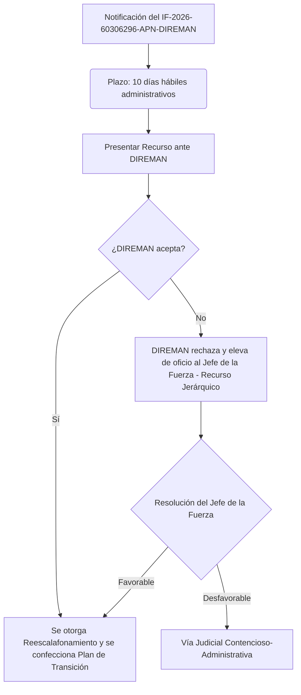

# Análisis Jurídico de la Denegatoria de Reescalafonamiento y Estrategia de Recurso

Este documento presenta un análisis crítico del acto administrativo de rechazo **IF-2026-60306296-APN-DIREMAN#GNA**, notificado al **1er Alf (RCL-ASI) Leonardo Andrés Lucero** en fecha **02 de julio de 2026**. Asimismo, establece la estrategia legal y proporciona el borrador del escrito de impugnación correspondiente.

---

## 1. Síntesis de los Argumentos de la Dirección de Recursos Humanos (DIREMAN)

La denegatoria de la Dirección de Recursos Humanos se sustenta principalmente en tres puntos:

1. **Condición de Ingreso vs. Condición Actual:** Argumenta que el causante ingresó a la Fuerza en el Escalafón Reclutamiento Local concursando con un título terciario ("Analista Programador" / "Analista de Sistemas").
2. **Inexistencia de Aptitud en el Nuevo Listado:** Sostiene que la especialidad actual del causante ("Analista de Sistemas" / ASI) no se encuentra individualizada en el listado de aptitudes de la nueva Especialidad "Tecnologías de la Información y Comunicación" (TIC) del Escalafón Apoyo Técnico (creada por [DI-2025-206-APN-DINALGEN#GNA](file:///g:/GNA-DOC/GNA-2026/rescalafonamiento/Normativa%20GNA/DI-2025-206-APN-DINALGEN%23GNA.txt)).
3. **Inexistencia de Subplanes de Carrera e Igualdad ante la Ley:** Afirma que el Escalafón Apoyo Técnico no posee subplanes de carrera para asimilar a quienes ingresaron con nivel terciario y que proceder al reescalafonamiento violaría la igualdad ante la ley en detrimento del personal que ingresó directamente a Apoyo Técnico ostentando título universitario desde el inicio.

---

## 2. Refutación Técnico-Normativa de la Denegatoria

Los argumentos de DIREMAN incurren en graves errores de interpretación reglamentaria, contradicen precedentes vigentes en la Fuerza y omiten mandatos expresos de la máxima autoridad de la Gendarmería.

### A. Violación de la Letra de la Disposición [DI-2025-1198-APN-DINALGEN#GNA](file:///g:/GNA-DOC/GNA-2026/rescalafonamiento/Normativa%20GNA/DI-2025-1198-APN-DINALGEN%23GNA.txt) (Desviación de Poder)
* El **Artículo 2º de la DI-2025-1198** establece: *"El personal con título universitario habilitante que revista en el Escalafón Reclutamiento Local [...] podrá optar voluntariamente..."*. 
* El término rector es **"revista"** (tiempo presente). Exige únicamente dos condiciones concurrentes al momento de ejercer la opción: **1)** revistar en Reclutamiento Local, y **2)** poseer título universitario habilitante. 
* El causante reviste en Reclutamiento Local y posee el título de grado de **Licenciado en Informática** (otorgado por la Universidad Blas Pascal en 2014), cumpliendo de manera exacta con el supuesto de hecho de la norma.
* DIREMAN, al exigir que el título de grado haya sido el título de *ingreso*, incorpora un requisito restrictivo no contemplado por el Director Nacional de Gendarmería, excediendo sus competencias jerárquicas y desnaturalizando el derecho concedido.

### B. Incumplimiento del Mandato Reglamentario de Transición (Teoría de la Ocurrencia del Propio Hecho Impediente)
* El **Artículo 3º de la DI-2025-1198** instruye expresamente: *"La Dirección de Recursos Humanos deberá realizar los planes de transición y adecuaciones que fueran necesarias..."*.
* La alegada "falta de subplanes de carrera" no es un impedimento legal para el causante, sino un **incumplimiento de DIREMAN** a su propia obligación reglamentaria. La Administración no puede fundar la denegatoria de un derecho en su propia inacción o retraso administrativo para dictar los planes de adecuación ordenados por la superioridad.

### C. Contradicción con Precedentes Orgánicos directos ([DI-2021-1810-APN-DINALGEN#GNA](file:///g:/GNA-DOC/GNA-2026/rescalafonamiento/Normativa%20GNA/DI-2021-1810-APN-DINALGEN%23GNA%20%20Reescalafonamiento%20del%20Personal%20de%20Oficial%20de%20Escalaf%C3%B3n%20Reclutamiento%20Local.txt))
* En el año 2021, la Fuerza llevó a cabo un proceso de reescalafonamiento idéntico mediante la **DI-2021-1810** para profesionales de Sanidad, Justicia y Apoyo Técnico que revistaban en Reclutamiento Local.
* El considerando de dicha norma define que unificar las especialidades idénticas que estaban divididas en dos escalafones bajo condiciones distintas **garantiza la igualdad de oportunidades**. 
* En el **Artículo 4º de la DI-2021-1810**, se ordenó a Recursos Humanos regularizar los años de servicio, demostrando que es técnica y legalmente viable asimilar a los oficiales sin violentar la carrera administrativa.

### D. Auto-Contradicción Institucional y Doctrina de Actos Propios ([Dictamen IF-2024-119942037-APN-DIREMAN#GNA](file:///g:/GNA-DOC/GNA-2026/rescalafonamiento/Normativa%20GNA/IF-2024-119942037-APN-DIREMAN%25GNA.txt))
* El Dictamen previo de la propia Dirección de Recursos Humanos redactado en el Exp. Matriz EX-2024-45300120 afirmó taxativamente: *"...deberá darse la oportunidad al personal que reviste dentro del Escalafón Reclutamiento Local para que de manera voluntaria opte por uno u otro Escalafón [...] por lo que será necesario establecer el plan de carrera que para cada caso corresponda..."*.
* DIREMAN ya había previsto y calificado como legalmente viable la asimilación del personal que ingresó como Subalférez, Alférez y Primer Alférez. Negarlo ahora argumentando que "ingresó con título terciario" constituye un viraje arbitrario que lesiona la confianza legítima y vulnera la Doctrina de los Actos Propios en el ámbito del derecho administrativo.

### E. Confusión entre Especialidad de Origen y Aptitud Habilitante de Destino
* DIREMAN argumenta que "Analista de Sistemas" no está en el listado de aptitudes de la especialidad TIC. 
* Esto confunde la especialidad de origen del causante en Reclutamiento Local con la aptitud de destino. La aptitud habilitante que posee el causante es su **Licenciatura en Informática**, la cual **sí** constituye una carrera habilitante y afín para la Especialidad TIC.
* Asimismo, la DIRTICOM, como órgano técnico calificado, propuso explícitamente incluir la especialidad "Analista de Sistemas" (ASI) en el listado de aptitudes de la especialidad TIC mediante informe **IF-2025-06897873**, en consonancia con la facultad delegada en el Art. 3º de la DI-2025-206.

---

## 3. Plan de Acción y Pasos Administrativos a Seguir

Al haberse notificado la denegatoria, se abre la vía de impugnación administrativa. La vía pertinente en el marco normativo de las Fuerzas de Seguridad y el Procedimiento Administrativo es interponer un **Recurso de Reconsideración con Jerárquico en Subsidio**.



### Pasos Operativos:
1. **Calcular el Plazo de Presentación:** El plazo general para el Recurso de Reconsideración es de **10 días hábiles administrativos**, computados a partir del día siguiente al de la notificación (efectuada el 02 de julio de 2026).
2. **Presentación del Recurso:** Debe redactarse por escrito formal, ingresarse a través de la Mesa de Entradas del Elemento de revista (Centro Asistencial "Buenos Aires") mediante Expediente Electrónico (GDE) dirigido al **Director de Recursos Humanos** con copia de elevación subsidiaria al **Jefe de la Gendarmería Nacional**.

---

## 4. Borrador del Escrito del Recurso Administrativo

A continuación, se detalla el texto sugerido para la presentación formal.

> [!IMPORTANT]
> Se deben verificar y, de ser necesario, completar los campos entre corchetes `[...]` con los datos exactos antes del envío.

```
SOLICITA REESCALAFONAMIENTO – INTERPONE RECURSO DE RECONSIDERACIÓN Y JERÁRQUICO EN SUBSIDIO CONTRA EL INFORME IF-2026-60306296-APN-DIREMAN#GNA

AL SEÑOR DIRECTOR DE RECURSOS HUMANOS DE LA GENDARMERÍA NACIONAL ARGENTINA

Quien suscribe, Primer Alférez (RCL-ASI) D. Leonardo Andrés LUCERO (MI: 31.098.540 - CE: 71.734-7), con actual prestación de servicios en el Centro Asistencial “BUENOS AIRES”, constituyendo domicilio a los efectos del presente trámite en el mencionado Elemento, me presento ante el Señor Director y respetuosamente digo:

I. OBJETO
Que en tiempo y forma, y de conformidad con lo establecido en la Reglamentación de Peticiones y Recursos vigente en la Fuerza y en forma subsidiaria por la Ley Nacional de Procedimientos Administrativos Nro. 19.549 y su Decreto Reglamentario 1759/72 (t.o. 2017), vengo a interponer enérgico RECURSO DE RECONSIDERACIÓN y JERÁRQUICO EN SUBSIDIO contra el acto denegatorio contenido en el Informe IF-2026-60306296-APN-DIREMAN#GNA, emitido por esa Dirección de Recursos Humanos y notificado formalmente a mi persona el día 02 de julio de 2026 en el marco del Expediente EX-2026-53890246-APN-DIBIESAN#GNA.

Solicito se revoque por contrario imperio el acto recurrido y, en consecuencia, se haga lugar a mi legítimo derecho de optar por el reescalafonamiento al Escalafón Apoyo Técnico, Especialidad "Tecnologías de la Información y Comunicación" (TIC), con el consecuente reconocimiento de mis años de servicios y mi título universitario de grado de Licenciado en Informática, todo ello con arreglo a los fundamentos de hecho y de derecho que paso a exponer.

II. ANTECEDENTES Y CUMPLIMIENTO DE REQUISITOS
1. Con fecha 13 de febrero de 2009, obtuve el Alta en la Fuerza en el Escalafón Reclutamiento Local, Especialidad "Analista de Sistemas" (ASI), con título de pregrado habilitante.
2. En el año 2014, culminé mis estudios de grado universitario, obteniendo el título de "Licenciado en Informática" emitido por la Universidad Blas Pascal (UBP). Dicho título fue debidamente registrado y forma parte de mis antecedentes académicos en mi Legajo Personal.
3. Mediante las Disposiciones DI-2025-206-APN-DINALGEN#GNA y su posterior ampliación DI-2025-1198-APN-DINALGEN#GNA, el Director Nacional de Gendarmería creó la Especialidad "Tecnologías de la Información y Comunicación" (TIC) en el Escalafón Apoyo Técnico y reguló el Derecho de Opción voluntario para el personal que revistare en el Escalafón Reclutamiento Local y contare con título universitario habilitante.
4. En pleno derecho y dentro de los plazos reglamentarios, ejercí formalmente la opción de traspaso, la cual ha sido denegada mediante el informe impugnado.

III. FUNDAMENTOS DE LA IMPUGNACIÓN
El acto administrativo recurrido adolece de vicios graves en su motivación y causa, sustentado en una interpretación errónea y restrictiva de las normativas vigentes en la Fuerza, conforme a los siguientes puntos:

1. Violación del Artículo 2º de la Disposición DI-2025-1198-APN-DINALGEN#GNA:
La denegatoria sostiene de manera errónea que no resulta viable el reescalafonamiento en razón de haber concursado originalmente con un título terciario para el Escalafón Reclutamiento Local. Esta postura agrega un requisito limitativo no previsto en la norma emanada de la máxima autoridad de la Fuerza. El Artículo 2º de la DI-2025-1198 prevé el derecho de opción para "El personal con título universitario habilitante que revista en el Escalafón Reclutamiento Local...". La norma utiliza el verbo en presente ("revista"), enfocándose en la condición académica del oficial al momento de ejercer la opción y no al momento de su ingreso. Exigir retroactivamente que el título universitario haya sido el de ingreso resulta arbitrario y carece de sustento legal, vulnerando el principio de jerarquía de las normas administrativas (Art. 14, Ley 19.549).

2. Incumplimiento de la Obligación Reglamentaria de Recursos Humanos (Art. 3º, DI-2025-1198):
Esa Dirección argumenta que el Escalafón Apoyo Técnico no posee subplanes de carrera para asimilar al personal en mi jerarquía. Al respecto, el Artículo 3º de la DI-2025-1198 es categórico al ordenar: "La Dirección de Recursos Humanos deberá realizar los planes de transición y adecuaciones que fueran necesarias...". Por tanto, la inexistencia de dichos planes constituye una omisión reglamentaria de la propia Dirección de Recursos Humanos. De acuerdo con el principio general del derecho y la doctrina administrativa, la Administración no puede alegar su propio incumplimiento o inacción reglamentaria como causa extintiva o denegatoria de un derecho subjetivo expresamente otorgado a los administrados.

3. Existencia de Precedentes Directos en la Fuerza (DI-2021-1810-APN-DINALGEN#GNA):
Es menester destacar que la viabilidad técnica y legal de reescalafonamiento y transición de oficiales profesionales desde Reclutamiento Local hacia los escalafones correspondientes a su naturaleza (Sanidad, Justicia y Apoyo Técnico) ya ha sido regulada y ejecutada con éxito en la Fuerza mediante la Disposición DI-2021-1810-APN-DINALGEN#GNA. Dicha disposición no solo sentó el precedente técnico, sino que en sus considerandos estableció expresamente que la unificación de escalafones persigue garantizar la "igualdad de oportunidades", y ordenó en su Artículo 4º regularizar los años de servicio del personal reescalafonado. 

4. Contradicción con el Dictamen Técnico de la Dirección (IF-2024-119942037-APN-DIREMAN#GNA) y Doctrina de Actos Propios:
La denegatoria entra en abierta contradicción con el Dictamen IF-2024-119942037 emitido por esa misma Dirección de Recursos Humanos (Orden 12, Exp. EX-2024-45300120), el cual expresaba literalmente: "En el hipotético caso de crearse la Especialidad TIC dentro del Escalafón Apoyo Técnico, deberá darse la oportunidad al personal que reviste dentro del Escalafón Reclutamiento Local para que de manera voluntaria opte por uno u otro Escalafón, teniéndose en cuenta que el personal se incorporó con la jerarquía de Primer Alférez, Alférez y Subalférez, por lo que será necesario establecer el plan de carrera que para cada caso corresponda...".
Este repentino cambio de criterio vulnera la Doctrina de los Actos Propios ("venire contra factum proprium non valet") y el Principio de Buena Fe Administrativa, los cuales impiden a los órganos del Estado adoptar conductas contradictorias que lesionen legítimas expectativas de derecho generadas por sus propios actos precedentes.

5. Correspondencia de la Aptitud Profesional:
La afirmación respecto a que la especialidad actual "Analista de Sistemas" no se encuentra en el nuevo listado de la Especialidad TIC resulta inoponible. Mi título universitario de grado de Licenciado en Informática (año 2014) encuadra plenamente dentro de las aptitudes requeridas para la Especialidad TIC. Asimismo, la Dirección de Tecnologías de la Información y Comunicaciones (DIRTICOM), órgano con competencia técnica específica de la Fuerza, propuso expresamente mediante informe IF-2025-06897873 la incorporación de la especialidad "Analista de Sistemas" (ASI) en el listado de aptitudes de la especialidad TIC, lo cual debió haber sido implementado por esa Dirección de Recursos Humanos haciendo uso de las facultades del Art. 3º de la DI-2025-206.

IV. PETITORIO
Por todo lo expuesto, al Señor Director de Recursos Humanos pido:
1. Se tenga por interpuesto en tiempo y forma el presente Recurso de Reconsideración con Jerárquico en Subsidio contra el Informe IF-2026-60306296-APN-DIREMAN#GNA.
2. Se revoque por contrario imperio el acto impugnado, haciéndose lugar al reescalafonamiento del suscripto al Escalafón Apoyo Técnico, Especialidad "Tecnologías de la Información y Comunicación" (TIC).
3. Para el caso en que se decline mi solicitud en esta instancia, se conceda formalmente el Recurso Jerárquico interpuesto en subsidio y se eleven los actuados al Señor Jefe de la Gendarmería Nacional Argentina para su resolución definitiva.

Proveer de conformidad,
SERÁ JUSTICIA.
```
